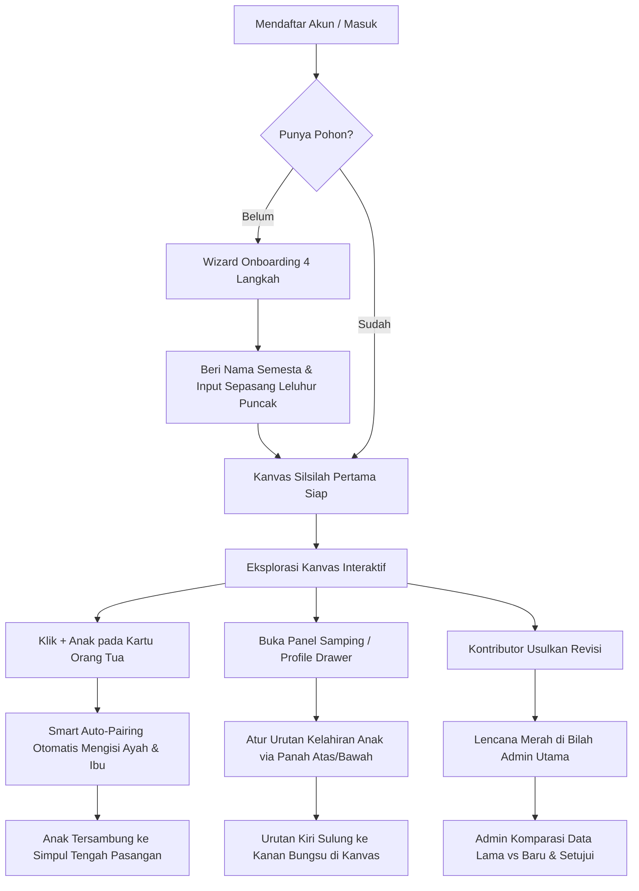

# 🎨 Perjalanan Desain & Panduan UX (UX Journey & Design System)

> **Proyek:** Silsilah Keluarga Kolaboratif  
> **Filosofi Visual:** Neo-Monochrome Precision with Functional Accents  
> **Target Pengalaman:** Award-Winning Usability, Zero-Confusion Genealogi, Touchpad-First Fluidity

---

## 1. Filosofi Desain & Standar Vibe Coding

Aplikasi silsilah keluarga tradisional seringkali terperangkap dalam dua ekstrem:
1. Terlalu rumit (*bloated* seperti software genealogi dekade 90-an).
2. Terlalu kaku (*over-simplified*, tidak bisa menangani kasus poligami, pernikahan ganda, atau urutan kelahiran).

**Prinsip Desain Kami:**
- **Clarity over Clutter:** Kartu silsilah berukuran kompak, tipografi monospasi untuk metadata teknis (ID, tanggal lahir, versi data), dan font sans-serif tebal untuk nama keluarga.
- **Color with Purpose (Bukan Sekadar Hiasan):** Palet dasar bernuansa monokromatik abu-abu gelap (*Zinc-900* dan *Zinc-50*) dengan aksen warna fungsional:
  - 🟡 **Kuning Kunyit (`#f7e043`):** Simbol brand utama, penanda gender, dan tombol konfirmasi aksi.
  - 🟠 **Kuning Amber (`#f59e0b`):** Relasi suci pernikahan (cincin 💍 & garis antar pasangan).
  - 🚇 **Subway Lineage Palette:** Garis percabangan keturunan dibedakan berdasarkan muasal leluhur (Hitam, Biru, Zamrud, Violet, Mawar, Sian) agar tidak melebur.
  - 🔴 **Merah Mawar (`#e11d48`):** Notifikasi usulan tertunda (*pending approvals*) dan aksi destruktif (hapus).

---

## 2. Matriks Persona Pengguna & Otoritas

| Peran | Persona | Kebutuhan Utama | Pola Interaksi |
|---|---|---|---|
| **ADMIN_UTAMA** | Kepala Keluarga / Sesepuh / Pengelola Utama | Menjaga keabsahan data, mengundang kerabat, meninjau usulan. | Akses sunting langsung tanpa konfirmasi, hak persetujuan (*Approve/Reject*), menghapus relasi. |
| **KONTRIBUTOR** | Anak / Cucu / Kerabat Dekat | Melengkapi data keluarga kecilnya tanpa merusak data leluhur utama. | Dapat menambah anak/pasangan. Sunting data yang sudah ada otomatis menjadi usulan (*Proposal*). |
| **VIEWER** | Anggota Keluarga Luas / Generasi Muda | Melihat garis keturunan, mencetak silsilah, membaca riwayat. | Eksplorasi interaktif (pan/zoom), pencarian nama, ekspor gambar PNG HD & HTML portabel. |

---

## 3. Peta Perjalanan Pengguna (User Journeys)



### Journey 1: Onboarding Pengguna Baru
- **Masalah Lama:** Pengguna bingung memulai dari mana pada kanvas kosong.
- **Solusi Kami:** Wizard 4 langkah membimbing pengguna menentukan nama semesta keluarga dan langsung menginput sepasang leluhur puncak (Kakek & Nenek) dengan opsi pasangan. Begitu selesai, kanvas langsung hidup dengan struktur awal yang valid.

### Journey 2: Pertumbuhan Keluarga & Auto-Pairing
- **Masalah Lama:** Pengguna harus menginput ulang ID Ayah dan Ibu secara manual untuk setiap anak.
- **Solusi Kami:** Tombol `+ Anak` pada kartu ayah otomatis menyertakan ibu yang sah sebagai pasangan default, menempatkan anak langsung mengalir dari simpul tengah pernikahan (*Family Knot*).

### Journey 3: Penataan Urutan Kelahiran (Birth Order)
- **Masalah Lama:** Anak pertama (Sulung) sering tertukar posisinya dengan anak bungsu karena urutan acak database.
- **Solusi Kami:** Tombol panah reorder `▲` dan `▼` di panel samping profil memungkinkan keluarga mengatur urutan lahir dengan satu klik, yang langsung tercermin secara visual di kanvas silsilah (kiri = anak tertua, kanan = anak termuda).

### Journey 4: Penanganan Relasi In-Laws & Poligami
- **Masalah Lama:** Silsilah yang melibatkan dua garis keluarga sejajar (misal: orang tua dari pihak istri) membuat garis bertumpuk dan tidak bisa dibedakan.
- **Solusi Kami:** 
  - Simpul perkawinan independen (*Knot Node*) dapat digeser bebas.
  - Setiap garis keturunan memiliki warna linimasa unik (*Subway Color*).
  - Garis horizontal anak bertingkat secara paralel (*Bus Staggering*).

---

## 4. Model Interaksi & Spesifikasi Gestur

### Navigasi Desktop & Laptop Trackpad
- **Scroll Dua Jari (Pan):** Menggeser kanvas secara dua dimensi (horizontal & vertikal) layaknya navigasi di Figma atau Google Maps.
- **Pinch-to-Zoom:** Memperbesar detail kartu atau memperkecil diagram untuk melihat panorama silsilah besar.
- **Tombol Sentral "Rapikan Layout (TB)":** Mengembalikan seluruh node dan garis silsilah ke posisi matematis simetris ideal (Bottom-Up Subtree) kapan saja pengguna selesai bereksperimen.

### Antarmuka Responsif Mobile
- **Bottom Sheet Profile Drawer:** Di layar ponsel, panel detail anggota bertransformasi menjadi *bottom sheet* dengan *pull-bar indicator* yang mudah dijangkau satu jempol.
- **Quick Action FAB:** Tombol mengambang di pojok kanan bawah memuat aksi cepat (+ Anggota, Rapikan Layout, Buka Panduan) agar layar tetap bersih dari tombol header yang sempit.

---

## 5. Token Desain (Design Tokens)

```css
/* Color System */
--color-brand-yellow: #f7e043;
--color-marriage-amber: #f59e0b;
--color-bg-canvas: #ffffff;
--color-border-card: #e4e4e7;
--color-border-active: #18181b;

/* Lineage Palette */
--lineage-primary: #18181b;   /* Hitam Garis Utama */
--lineage-branch-1: #2563eb;  /* Biru Cabang 1 */
--lineage-branch-2: #059669;  /* Zamrud Cabang 2 */
--lineage-branch-3: #7c3aed;  /* Violet Cabang 3 */
--lineage-branch-4: #e11d48;  /* Mawar Cabang 4 */
--lineage-branch-5: #0891b2;  /* Sian Cabang 5 */

/* Typography */
--font-sans: 'Inter', system-ui, -apple-system, sans-serif;
--font-mono: 'JetBrains Mono', 'Fira Code', monospace;
```
